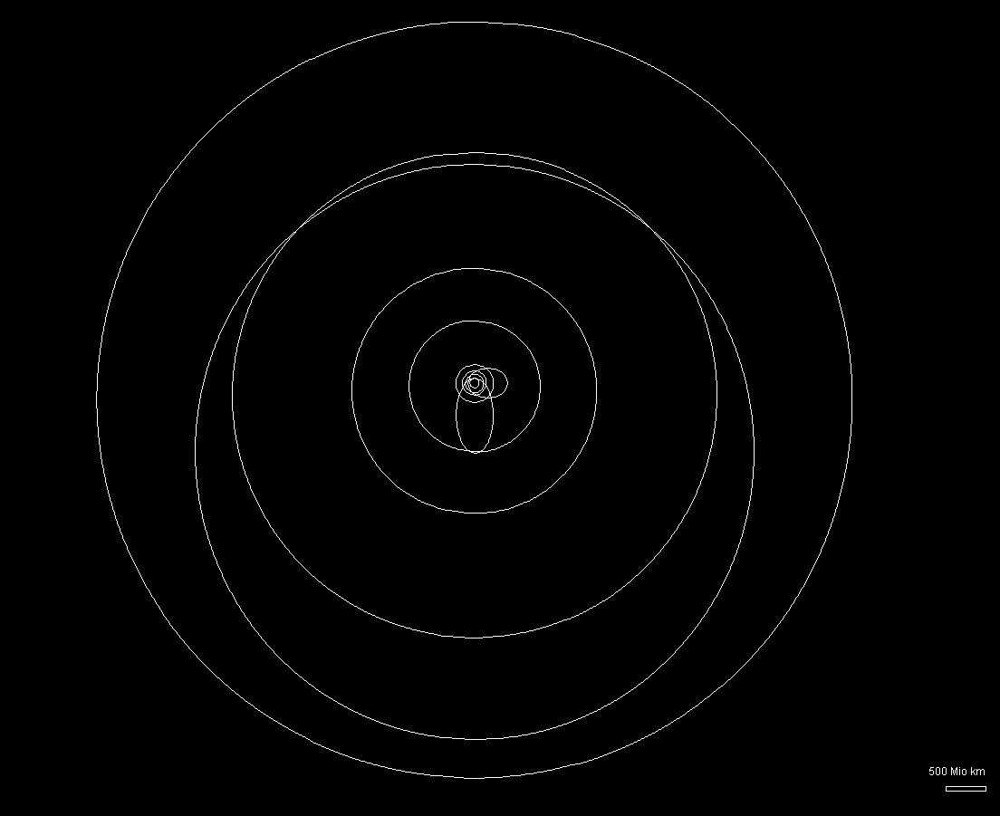
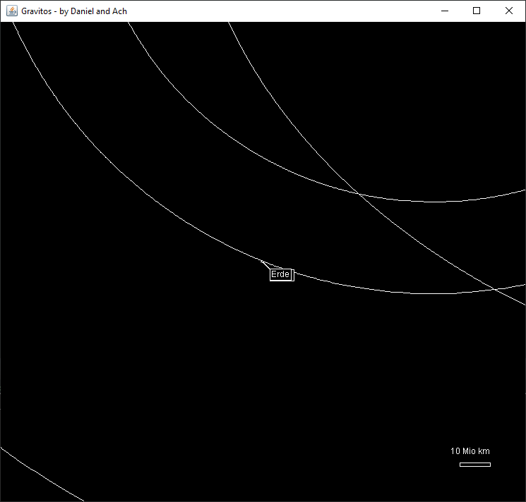

# Gravi Sim / "Gravitos"

A simulation of our solar system in Java, presented at a highschool science fair.

The Simulation will track every body for an entire rotation and determine Apoapsis, Periapsis,... to draw the corresponding orbits.

